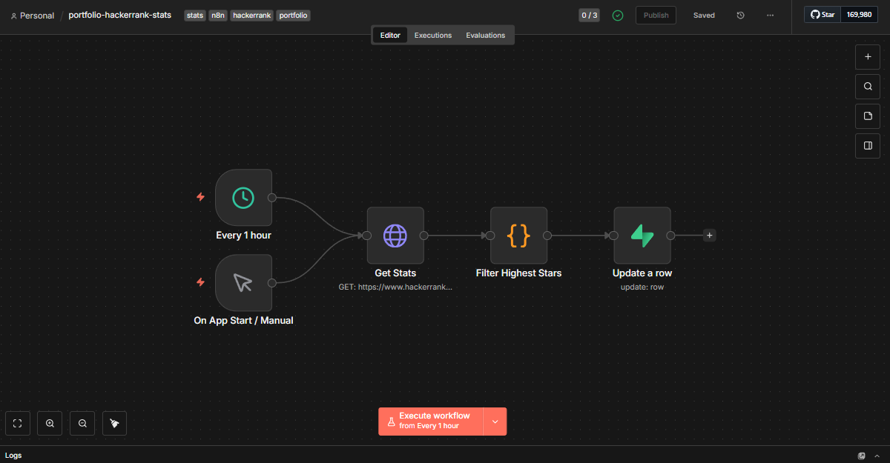

# 🤖 HackerRank Stats Automation with n8n & Supabase


[](https://opensource.org/licenses/MIT)
[](https://ridwansuryantara.netlify.app)

**Automated tracking of HackerRank profile statistics such as badges earned, star ratings, and skill proficiency using n8n with data stored in Supabase.**

## 📖 Overview

This repository hosts an n8n workflow designed to track your competitive programming progress on HackerRank. It runs on a schedule (every 1 hour) to fetch badge and skill data using HackerRank's REST API, processes the highest achieved stars, and updates the statistics in a Supabase database.

## 📸 Workflow Preview



## ✨ Features

* **Automated Scheduling:** Runs automatically every 1 hour or on app start.
* **REST API Integration:** Connects to HackerRank's public endpoint to retrieve user badges.
* **Data Aggregation:** Uses custom JavaScript logic to:
    * 🏅 **Count Badges:** Tracks the total number of badges earned.
    * ⭐ **Track Stars:** Extracts star ratings for specific skills (e.g., Python, Problem Solving).
    * 📈 **Highest Star:** Automatically determines the highest star level achieved across all skills.
* **Data Storage:** Processes and updates the corresponding row in **Supabase**.

## 🛠️ Tech Stack

* **Automation:** [n8n](https://n8n.io/) (Self-hosted/Cloud)
* **Database:** [Supabase](https://supabase.com/) (PostgreSQL)
* **Source:** HackerRank Internal REST API

## 🚀 How to Use

### 1. Import Workflow
* Download the `.json` file from this repository.
* Open your n8n editor.
* Click the menu (top right) and select `Import from File`.

### 2. Configure Nodes

Follow the steps below to configure each node with your own HackerRank Username and Database credentials.

#### ⏰ Schedule (Every 1 Hour)
* Set the **Trigger Interval** (e.g., Every 1 Hour) based on how often you want to track data.

#### 🌐 Get Stats (HackerRank API)
* **Method:** `GET`
* **URL:** Replace `YOUR_USERNAME` with your actual HackerRank username.
    ```text
    [https://www.hackerrank.com/rest/hackers/YOUR_USERNAME/badges](https://www.hackerrank.com/rest/hackers/YOUR_USERNAME/badges)
    ```
    *Example:* `https://www.hackerrank.com/rest/hackers/ridwansuryantara/badges`
* **Headers:**
    * **Crucial:** You must add a `User-Agent` header to mimic a real browser, otherwise HackerRank might block the request.
    * `Name`: `User-Agent`
    * `Value`: `Mozilla/5.0 (Windows NT 10.0; Win64; x64) AppleWebKit/537.36 (KHTML, like Gecko)`

#### 🧮 Filter Highest Stars
* This node runs JavaScript code to process the array of badges.
* It calculates the total number of badges and finds the highest star rating you have achieved in any single skill.
* *Customization:* You can modify the code if you want to filter for specific badges only (e.g., "Gold" badges).

#### 💾 Update a row Supabase
* **Operation:** `Update`
* **Table:** `platform_stats` (or your specific table name).
* **Authentication:**
    * Select **Predefined Credential Type** -> **Supabase API**.
    * Select your credentials.
* **Update Condition:**
    * The workflow is set to update a row where `platform` equals `'hackerrank'`.
    * *Important:* Ensure you have a row in your database with the column `platform` set to `hackerrank` before running this, or switch the operation to "Upsert".

### 3. Activate
* Toggle the workflow to **Active** in the top right corner.

## 📝 Data Structure

The workflow prepares a JSON object similar to this before sending to Supabase:

```json
{
  "total_badges": 8,
  "highest_star": 5,
  "stars": {
    "Python": 5,
    "Problem Solving": 4,
    "Java": 3
  },
  "last_fetched": "2026-01-20T12:00:00.000Z",
  "platform": "hackerrank"
}
